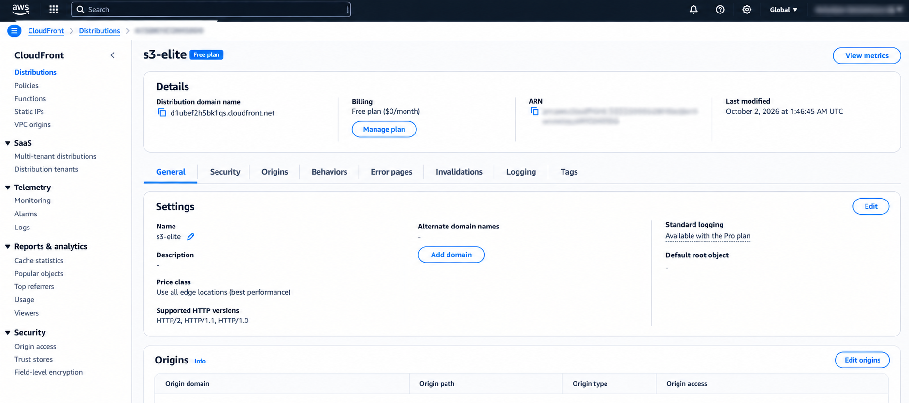

# AWS Cloud Engineering Project

A hands-on AWS project focused on **secure storage, monitoring, cloud security, and Infrastructure as Code.**

## 🏗️ Architecture

```text
              INTERNET
                  │
                HTTPS
                  ▼
           ┌─────────────┐
           │ CloudFront  │
           │     OAC     │
           └──────┬──────┘
                  ▼
           ┌─────────────┐
           │ S3 Private  │
           │   Bucket    │
           └─────────────┘

      EC2 ──► IAM Role ──► S3
       │
       ▼
  CloudWatch ──► Alarm ──► SNS ──► Email
```

## 🚀 Tasks

### 01 — Secure Cloud Storage
- Private S3 bucket
- Versioning & SSE-S3 encryption
- Block Public Access
- IAM Role-based access
- CloudFront + OAC

### 02 — Monitoring & Alerts
- CloudWatch EC2 monitoring
- CPU alarm at **70%**
- SNS email notification

### 03 — Multi-Cloud
**Planned:** Google Cloud integration and multi-cloud architecture.

## ☁️ AWS Services

`S3` • `EC2` • `CloudFront` • `IAM` • `CloudWatch` • `SNS` • `CloudFormation`

## 🔐 Security

- Private S3 storage
- Block Public Access
- Encryption at rest
- IAM least privilege
- CloudFront OAC
- No long-lived credentials on EC2

## ⚙️ Infrastructure as Code

AWS CloudFormation is used to define the S3 and IAM infrastructure.

```text
cloudformation/
└── s3-infrastructure.yaml
```

## 📸 Screenshots

### S3 Security


### CloudFront



### Monitoring


### IAM


## 📂 Project Structure

```text
aws-cloud-engineering-project/
├── README.md
├── LICENSE
├── .gitignore
├── cloudformation/
│   └── s3-infrastructure.yaml
└── screenshots/
```

## 📊 Status

| Task | Status |
|---|---|
| Secure Cloud Storage | ✅ Completed |
| Monitoring & Alerts | ✅ Completed |
| Multi-Cloud | 🔄 Planned |

## 👨‍💻 Author

**Tahir Chhipa**  
Cloud Engineering Fresher | AWS • Linux • CloudFormation • CI/CD
